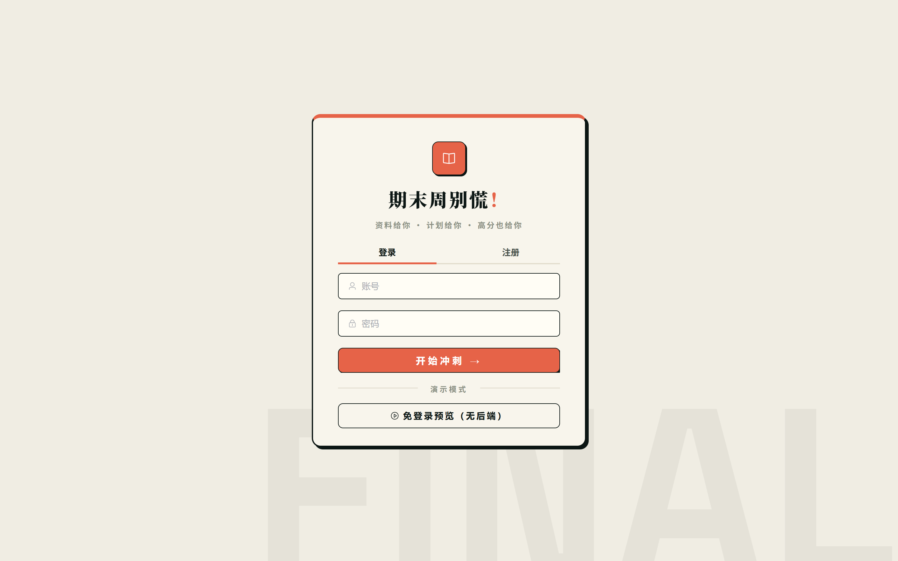
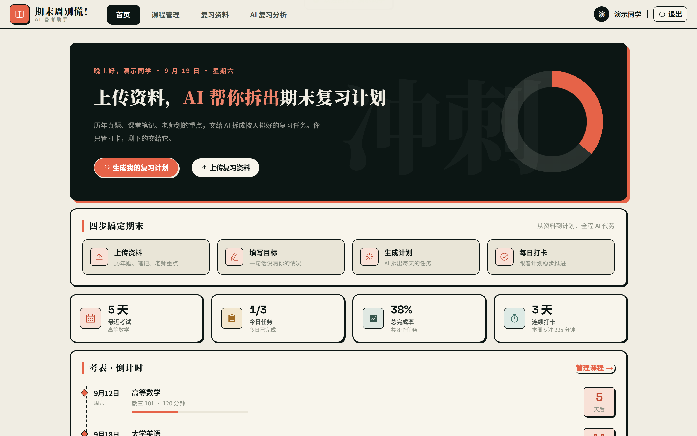
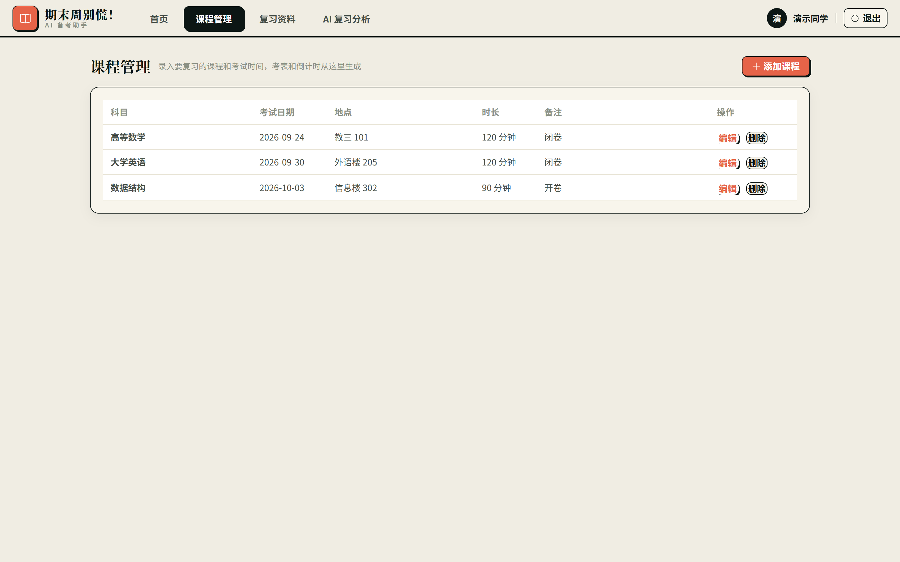
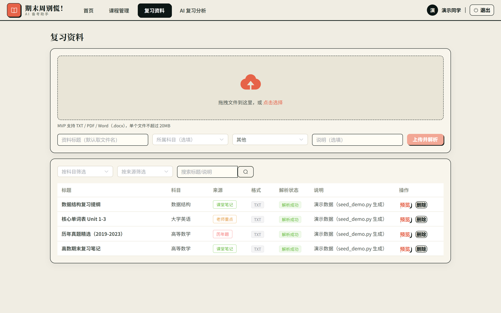
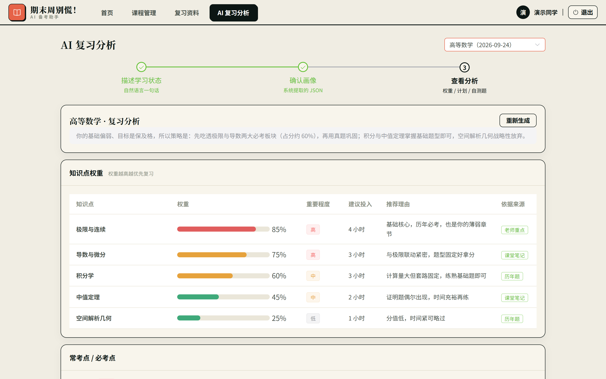

# 📚 期末周别慌！—— AI 智能备考网站

> 四川大学计算机学院 2024 级《问题求解实战》课程 · 刘添屹小组
>
> **一句话**：上传复习资料 + 描述学习状态 → AI 生成个性化复习重点、按天复习计划和自测题 → 每天打卡冲刺期末。
>
> **核心流程**：注册登录 → 录入考试 → 上传资料 → 描述学习状态 → AI 提取画像 → AI 生成分析 → 每日任务打卡 → 首页看倒计时与进度。

---

## 界面预览

| 登录 | 首页 |
|---|---|
|  |  |

| 考试管理 | 复习资料 | AI 复习分析 |
|---|---|---|
|  |  |  |

界面为实际运行截图（首页为本地预览数据，其余为真实接口数据）。

## 项目状态

- **需求分析已完成并交付**：《期末周别慌_系统需求分析.docx》V1.2，87 页，9 个模块 57 个用例、68 张 UML 图、数据字典、72 条需求对照记录；配套 16 页汇报 PPT 与 10 分钟讲解稿在 `需求分析汇报/`
- **代码已完成骨架与核心流程**：注册登录 → 录入考试 → 上传复习资料 → 描述学习状态 → AI 提取画像 → 生成分析 → 计划落为每日任务 → 打卡看进度，本地可完整跑通（默认 Mock 模式，不需要申请 API Key）
- **进行中**：57 个用例中 13 个已前后端打通、11 个已有基础版待完善、33 个待开发，由小组 5 人按第 8 节分工推进

---

## 1. 项目简介

「期末周别慌！」是面向大学生期末复习场景的一站式智能备考网站。学生上传历年题、老师划的重点、课堂笔记、作业练习等多源复习资料，用一句话描述自己的备考目标与学习状态，系统调用 DeepSeek 大模型分析常考必考内容、计算知识点权重，为不同目标和基础的学生生成**差异化**的复习方案、按天计划与自测题；配套任务打卡、统计图表、压力指数、救急模式等功能，帮助学生在期末周科学高效地复习。

**项目亮点（写进需求分析里的创新点）：**

1. **两级权重体系** —— 把「资料权重」（按来源类型衡量资料可信度）与「知识点权重」（按历年题必考点衡量知识点重要性）分离，分析结果既有依据又有个性；
2. **画像驱动的差异化方案** —— 通过勾选表单（可选自然语言补充）快速建立学习画像，基础薄弱者优先保及格、基础扎实者追求高覆盖率，不同用户得到不同复习策略；
3. **历年题驱动的考点分析** —— 大模型重点提取历年题中的必考题与常考题型，复习重点与自测题贴合真实考试；
4. **人文关怀功能** —— 期末压力指数、临时救急模式、今日最重要的三件事、情绪记录，缓解考前焦虑。

---

## 2. 功能总览（谁要做什么，看这张表）

系统功能需求共 **9 个模块、57 个用例**，完整定义见《期末周别慌_系统需求分析.docx》。状态含义：

| 状态 | 含义 |
|---|---|
| ✅ | 已实现，前后端已打通 |
| 🔧 | 已有基础版，待完善（括号里写缺什么） |
| ⬜ | 未实现，即**待开发任务**（表里有负责人） |

### 模块 0 · 公共功能

| 用例 | 功能 | 逻辑要点 | 状态 | 负责人 |
|---|---|---|---|---|
| 0.1 | 身份认证与会话管理 | JWT 令牌有效期 7 天，过期重新登录；前端有登录守卫 | ✅ | — |
| 0.2 | 数据隔离与访问控制 | 后端从令牌解析用户标识，所有查询强制按用户过滤 | ✅ | — |
| 0.3 | 重要操作二次确认 | 删除账号/资料/考试/注销前弹二次确认框 | ⬜ | 宋跃月 |
| 0.4 | 操作日志记录 | 登录、资料增删改、AI 分析等关键操作落库，管理员可查 | ⬜ | 宋跃月 |
| 0.5 | 文件上传统一校验 | 扩展名+大小校验（TXT/PDF/DOCX 可解析，≤20MB），解析失败不阻断上传；PPT/图片解析为扩展方向 | 🔧 | 胡歆桐 |

### 模块 1 · 账号管理

| 用例 | 功能 | 逻辑要点 | 状态 | 负责人 |
|---|---|---|---|---|
| 1.1 | 注册账号 | 校验账号格式与唯一性，密码 bcrypt 哈希存储 | ✅ | — |
| 1.2 | 登录系统 | JWT 签发；连续 3 次失败锁定账号 | 🔧（锁定未做） | 许丽媛 |
| 1.3 | 账号锁定与密码找回 | 输入账号+学号验证身份，重置密码后自动解锁 | ⬜ | 许丽媛 |
| 1.4 | 编辑个人资料 | 头像/姓名/专业/年级/班级；后端 `PUT /auth/me` 已有 | 🔧（前端页面未做） | 许丽媛 |
| 1.5 | 注销账号 | 二次确认后清理或匿名化用户数据 | ⬜ | 许丽媛 |

### 模块 2 · 考试与日程管理

| 用例 | 功能 | 逻辑要点 | 状态 | 负责人 |
|---|---|---|---|---|
| 2.1 | 首页聚合视图 | 今日待办 + 考试倒计时 + 总进度 + 连续打卡 | ✅ | — |
| 2.2 | 录入考试安排 | 科目/日期/地点/时长 | ✅ | — |
| 2.3 | 修改/删除考试安排 | 删除需二次确认 | ✅ | — |
| 2.4 | 导入教务处统一考表 | 解析学校考表文件（Excel 等），批量录入 | ⬜ | 许丽媛 |
| 2.5 | 筛选查看考试列表 | 按学期/科目/状态筛选 | ⬜ | 许丽媛 |
| 2.6 | 创建备考计划与学习任务 | 手动建任务 + AI 计划自动落库 | ✅ | — |
| 2.7 | 编辑/删除学习任务 | 删除已有，编辑待加 | 🔧（编辑未做） | 许丽媛 |
| 2.8 | 倒推生成备考时间表 | 按考试日期倒推每日安排 | ⬜ | 许丽媛 |
| 2.9 | 任务冲突检测 | 同一天任务总时长超上限时提醒 | ⬜ | 许丽媛 |
| 2.10 | 日历视图与拖拽调整 | 月历展示、拖拽改期 | ⬜ | 许丽媛 |
| 2.11 | 番茄钟与每日学习目标 | 番茄钟计时、计入专注时长 | ⬜ | 张诗琪 |
| 2.12 | 科目颜色标签 | 每科固定颜色，全站统一 | ⬜ | 许丽媛 |
| 2.13 | ICS 导入导出 | 导出日历文件 | ⬜ | 许丽媛 |

### 模块 3 · 复习资料管理

| 用例 | 功能 | 逻辑要点 | 状态 | 负责人 |
|---|---|---|---|---|
| 3.1 | 上传复习资料 | 选科目 + 来源类型，后端解析 PDF/Word/TXT 文本 | ✅ | — |
| 3.2 | 资料标注与来源识别 | 七类来源：历年试题/老师重点/平时作业/课堂笔记/教材章节/实验报告/练习题 | 🔧（后端现有六类：历年题/老师重点/课堂笔记/作业/练习题/其他，教材章节、实验报告待接入） | 胡歆桐 |
| 3.3 | 资料分类整理 | 按科目/类型归档成综合资料库 | ⬜ | 胡歆桐 |
| 3.4 | 全文搜索与筛选 | 按关键词/科目/类型检索 | ⬜ | 胡歆桐 |
| 3.5 | 收藏与错题本 | 收藏资料、自测错题自动进错题本 | ⬜ | 胡歆桐 |
| 3.6 | 合并导出复习笔记 | 多份资料合并导出 Markdown/PDF | ⬜ | 胡歆桐 |

### 模块 4 · AI 智能分析（核心模块）

| 用例 | 功能 | 逻辑要点 | 状态 | 负责人 |
|---|---|---|---|---|
| 4.1 | 用户画像采集 | 勾选表单+自然语言 → 固定 JSON；缺字段时前端引导补全 | ✅ | — |
| 4.2 | 复习资料权重计算 | 按来源层级给默认权重，学生可手动调整 | 🔧（手动调整未做） | 胡歆桐 |
| 4.3 | 知识点与复习提纲提取 | 大模型从资料提取知识点清单与复习提纲 | ✅ | — |
| 4.4 | 思维导图与记忆卡片生成 | 提纲可视化 + 卡片式背诵 | ⬜ | 胡歆桐 |
| 4.5 | 资料问答 | 就资料内容向大模型提问 | ⬜ | 胡歆桐 |
| 4.6 | 自测题生成与自动判分 | 生成客观题；**自动判分未做**（判分结果进错题本，见 3.5） | 🔧 | 张诗琪 |
| 4.7 | 常考题型与高频考点分析 | 从历年题提取题型分布与高频考点 | ⬜ | 胡歆桐 |
| 4.8 | 知识点权重计算 | 历年题必考点定基础值，画像调整 → 复习优先级 | ✅ | — |
| 4.9 | 知识点可视化 | 权重图表化展示 | ⬜ | 胡歆桐 |
| 4.10 | 个性化复习方案生成 | 按画像生成按天计划，自动落为首页任务 | ✅ | — |
| 4.11 | 分级推荐策略 | 按「保及格/稳中等/冲高分」三档差异化推荐 | 🔧（策略待细化） | 胡歆桐 |
| 4.12 | 动态调整计划与权重 | 打卡进度/剩余天数变化时重排计划 | ⬜ | 胡歆桐 |
| 4.13 | 推荐依据解释 | 每个结论给出依据来源（已有基础版） | 🔧（解释话术待完善） | 胡歆桐 |
| 4.14 | 大模型输出约束与免责提示 | 结构化 JSON 输出已有；免责声明待加 | 🔧 | 胡歆桐 |

### 模块 5 · 学习统计

| 用例 | 功能 | 逻辑要点 | 状态 | 负责人 |
|---|---|---|---|---|
| 5.1 | 任务打卡 | 打卡/撤销，首页进度实时联动 | ✅ | — |
| 5.2 | 学习统计图表 | 完成率环图已有；**独立统计页**（各科进度/专注时长趋势）待做，接口 `GET /stats/{examId}` 已有 | 🔧 | 张诗琪 |
| 5.3 | 备考周报 | 每周生成复习小结 | ⬜ | 张诗琪 |

### 模块 6 · 提醒通知（整模块未实现）

| 用例 | 功能 | 逻辑要点 | 状态 | 负责人 |
|---|---|---|---|---|
| 6.1 | 考前与任务提醒 | 考前 N 天、任务逾期、每日计划提醒（站内/浏览器通知） | ⬜ | 张诗琪 |
| 6.2 | 通知管理 | 通知列表、已读、开关 | ⬜ | 张诗琪 |

### 模块 7 · 特色功能（整模块未实现，公式见第 3 节）

| 用例 | 功能 | 逻辑要点 | 状态 | 负责人 |
|---|---|---|---|---|
| 7.1 | 期末压力指数 | 每日定时计算 0~100，分档提示 | ⬜ | 宋跃月 |
| 7.2 | 临时救急模式 | 时间紧张时聚焦高频基础考点；可手动开启或由压力指数触发 | ⬜ | 宋跃月 |
| 7.3 | 考前重点回顾列表 | 考前按权重列出必看清单 | ⬜ | 宋跃月 |
| 7.4 | 今日最重要的三件事 | 按权重+截止时间+压力指数选出置顶 | ⬜ | 宋跃月 |
| 7.5 | 学习时段推荐 | 按画像推荐每日复习时段分配 | ⬜ | 宋跃月 |
| 7.6 | 情绪记录与复习节奏建议 | 每日 1~5 分自评，结合数据给节奏建议 | ⬜ | 宋跃月 |

### 模块 8 · 管理端功能（整模块未实现）

| 用例 | 功能 | 逻辑要点 | 状态 | 负责人 |
|---|---|---|---|---|
| 8.1 | 发布统一考试安排 | 管理员统一发布，学生一键导入 | ⬜ | 宋跃月 |
| 8.2 | 维护课程与科目信息 | 课程/科目基础数据管理 | ⬜ | 宋跃月 |
| 8.3 | 管理异常账号与违规内容 | 封禁、内容治理 | ⬜ | 宋跃月 |

---

## 3. 核心业务逻辑（动手实现前必读）

这些公式和规则是需求分析里定死的，实现时照抄，不要自己改口径。

### 3.1 两级权重体系

- **资料权重**（衡量「资料可不可信」，默认层级，学生可对单份资料手动调整）：
  `老师标注重点 ＞ 历年试题/练习题 ＞ 平时作业/课堂笔记 ＞ 教材章节/PPT/实验报告`
- **知识点权重**（衡量「知识点重不重要」，用于复习计划排序与个性化推荐）：
  历年题必考点分析确定**基础值** → 再按**用户画像**（目标/薄弱章节）调整。

### 3.2 用户画像（结构化 JSON）

勾选表单 + 可选自然语言描述，大模型提取为固定 JSON 字段：**备考目标、学习基础、剩余天数、每日可用时长、薄弱章节**。备考目标分三档：**保及格 / 稳中等 / 冲高分**。画像缺字段时系统不能瞎猜，前端弹补全表单。

### 3.3 期末压力指数（0~100）

```
压力指数 = 30×考试密集度 + 30×任务积压率 + 20×(1−任务完成率) + 20×考试临近度
```

- 考试密集度 = min(1, 未来 7 天考试场次÷4)；任务积压率 = 逾期未完成任务数÷总任务数；任务完成率 = 已完成任务数÷总任务数；考试临近度 = min(1, 21÷最近一场考试剩余天数)
- 分档：<40 轻松、40~60 适中、60~80 偏压、≥80 高压（≥70 建议开启救急模式）
- **边界约定**：无考试时考试密集度与考试临近度取 0；考试当天（剩余 0 天）临近度取 1；无任务时任务积压率与任务完成率取 0
- 每日定时计算

### 3.4 情绪综合评分（0~5）

```
情绪综合评分 = 0.4×情绪项 + 0.3×完成项 + 0.2×压力项 + 0.1×达标项
```

各分项均已归一化到 0~5，总评分范围精确为 0~5：

- 情绪项 = 5×(情绪自评−1)÷4（情绪自评 1~5）
- 完成项 = 5×当日任务完成率
- 压力项 = 5−压力指数÷20
- 达标项 = 5×连续达标因子；**连续达标因子 = min(连续达标天数,7)÷7**，连续达标天数 = 连续「当日任务全部完成」的天数

### 3.5 复习计划生成闭环

```
上传资料 → 解析文本 → 资料权重（来源层级）
        → 知识点权重（必考点 × 画像调整）
        → 分级推荐策略（三档目标）
        → 按天复习计划 → 自动落为每日任务
        → 打卡 → 进度统计 → 动态调整计划与权重（待实现）
```

### 3.6 大模型调用约定

- 后端 `LLM_MOCK=true`（默认）：不调用 API，返回内置示例数据，**不需要任何 Key**，可完整走通全流程；
- `LLM_MOCK=false`：调用 DeepSeek（OpenAI 兼容接口），模型 `deepseek-chat`，需在 `.env` 填 `DEEPSEEK_API_KEY`；
- 所有大模型输出必须是**固定 JSON 结构**（prompts 在 `backend/app/services/prompts.py`），解析失败要有兜底。

---

## 4. 技术栈

| 层 | 技术 |
|---|---|
| 前端 | Vue 3 + Vite + Pinia + Vue Router + Element Plus + Axios + ECharts |
| 后端 | Python 3.10+ / FastAPI / SQLAlchemy 2 / Pydantic v2 |
| 数据库 | SQLite（默认，开箱即用；换 MySQL 改 `DATABASE_URL` 一行即可） |
| 大模型 | DeepSeek API（OpenAI 兼容），内置 Mock 模式 |

---

## 5. 目录结构

```
项目根目录/
├── README.md                  # 本文件
├── 期末周别慌_系统需求分析.docx  # 需求分析交付文档（含 UML 图、数据字典、需求对照表）
├── docs/
│   ├── 开发须知.md             # 组员开工必读：怎么跑起来、你负责改哪些文件、哪些不能动
│   ├── 接口文档.md             # 前后端接口契约（开发前先看）
│   ├── 系统设计.md             # 系统设计说明
│   └── 答辩速查.md             # 演示脚本 + 答辩问答 + 公式速查（上台前看）
├── backend/                   # FastAPI 后端
│   ├── app/
│   │   ├── main.py            # 应用入口（挂载全部路由）
│   │   ├── config.py          # 配置（读 backend/.env）
│   │   ├── database.py        # SQLAlchemy 连接
│   │   ├── models/models.py   # 6 张表模型
│   │   ├── routers/           # auth / exams / materials / ai / tasks / dashboard
│   │   ├── schemas/           # Pydantic 请求/响应契约
│   │   ├── services/          # llm_client（含 Mock）、prompts、file_parser、plan_service
│   │   └── utils/             # JWT + bcrypt 等
│   ├── run.py                 # 启动入口：python run.py
│   ├── seed_demo.py           # 演示数据种子脚本（重置演示数据）
│   ├── smoke_test.py          # 全流程冒烟测试
│   ├── verify_formats.py      # AI 输出格式校验
│   ├── requirements.txt
│   └── .env.example           # 复制为 .env 使用
└── frontend/                  # Vue 3 前端
    ├── src/
    │   ├── api/               # axios 封装 + 接口函数（与接口文档一一对应）
    │   ├── mock/dashboard.js  # USE_MOCK 开关 + 首页假数据
    │   ├── router/index.js    # 路由 + 登录守卫
    │   ├── stores/user.js     # Pinia 用户状态（token 存 localStorage）
    │   ├── styles/index.css   # 全局设计系统（纸×墨×珊瑚配色、组件主题）
    │   └── views/             # Login / Layout / Home / Exams / Materials / Analysis
    ├── index.html
    ├── package.json
    └── vite.config.js         # 开发代理：/api → http://127.0.0.1:8000
```

---

## 6. 本地运行

```bash
git clone https://github.com/Danielliu1219/fmzh.git
cd fmzh
```

> 需要 Node.js ≥ 18 和 Python 3.10+。建议先按 6.1 把前端跑起来看效果，再按 6.2 联调后端。

### 6.1 只看界面（不需要后端，最快上手）

```bash
cd frontend
npm install        # 首次需要，装一次即可
npm run dev
```

打开 **http://localhost:5173**，登录页底部有「**免登录预览（无后端）**」按钮，点击直接进首页，所有数据是内置假数据。

> 原理：`frontend/src/mock/dashboard.js` 里 `USE_MOCK = true` 时首页用本地假数据渲染。联调真实后端时把它改回 `false`，预览按钮会自动消失。

### 6.2 完整联调（前端 + 后端）

**先启动后端**（终端 1）：

```bash
cd backend
python -m venv .venv
.venv/Scripts/pip install -r requirements.txt    # Windows；macOS/Linux 用 .venv/bin/pip
copy .env.example .env                           # Windows；macOS/Linux 用 cp
.venv/Scripts/python run.py                      # Windows；macOS/Linux 用 .venv/bin/python
```

- 后端地址：http://127.0.0.1:8000 ，交互式接口文档：http://127.0.0.1:8000/docs
- 默认 `LLM_MOCK=true`，不需要 DeepSeek Key，全流程可演示

**灌入演示数据**（可选，新终端）：

```bash
cd backend
.venv/Scripts/python seed_demo.py
```

效果：给数据库里**每个用户**生成一套统一演示数据（含演示账号 `demo / demo123456`；3 门考试 = 当天+5/+11/+14 天、3 份资料、完整画像与分析、8 个任务 3 个已完成）。**重跑会重置该用户演示数据**，任何时候重跑都是"新鲜"的。

**再启动前端**（终端 2）：

```bash
cd frontend
npm install
npm run dev
```

打开 http://localhost:5173 ，把 `src/mock/dashboard.js` 的 `USE_MOCK` 改回 `false`，注册/登录（或直接用 demo/demo123456）即可走真实接口。

### 6.3 两个 Mock 开关的区别（容易混，务必分清）

| 开关 | 位置 | 作用 |
|---|---|---|
| `USE_MOCK` | `frontend/src/mock/dashboard.js` | **前端**首页数据用假数据还是调接口；true 时登录页出现免登录预览按钮 |
| `LLM_MOCK` | `backend/.env` | **后端**大模型调用返回内置示例还是调 DeepSeek API；两者都不需要改代码 |

**接入真实 DeepSeek**：到 platform.deepseek.com 申请 API Key → 编辑 `backend/.env`：`LLM_MOCK=false` + `DEEPSEEK_API_KEY=sk-你的key` → 重启后端。

### 6.4 后端冒烟测试

```bash
cd backend
.venv/Scripts/python smoke_test.py    # 后端启动后执行，自动走通注册→录考试→传资料→AI 分析→打卡全流程
```

---

## 7. 演示主线（答辩就讲这条线）

1. 注册登录（或 demo/demo123456）；
2. 「课程管理」录入一门考试（比如 5 天后的高等数学）；
3. 「复习资料」上传 TXT/PDF/Word 资料，选科目和来源类型（历年题/老师重点/…）；
4. 「AI 复习分析」选科目，输入一句话，例如：
   > 我这门课基本没学，只想及格，极限和积分不太会，还有五天考试，每天能学三小时
5. 系统提取画像 JSON；故意不说天数和时长会触发补全表单；
6. 生成复习分析：知识点权重、复习提纲、按天计划、自测题；
7. 复习计划自动变成「首页」的每日任务，打卡后进度实时更新。

---

## 8. 小组分工

> 项目现有成果（需求文档框架与基本内容、系统架构设计与代码框架、前端页面实现、项目统筹与任务安排）**均由组长刘添屹完成**。以下为后续开发与文书完善分工。

| 成员 | 角色 | 后续开发任务 | 文书任务 |
|---|---|---|---|
| **刘添屹** | 组长 | 架构把关、代码审查（PR 合并）、疑难问题兜底 | 全文统稿与最终审核 |
| **许丽媛** | 组员 | 账号管理完善（1.2 锁定 / 1.3 找回 / 1.4 前端 / 1.5 注销）；考试与日程扩展（2.4 考表导入 / 2.5 筛选 / 2.7 任务编辑 / 2.8 倒推 / 2.9 冲突检测 / 2.10 日历视图 / 2.12 科目标签 / 2.13 ICS） | 账号管理、考试与日程管理章节的历次修订 |
| **胡歆桐** | 组员 | 复习资料扩展（3.3 分类 / 3.4 搜索 / 3.5 收藏错题本 / 3.6 合并导出）；AI 分析扩展（4.2 手动权重 / 4.4 思维导图卡片 / 4.5 资料问答 / 4.7 常考题型 / 4.9 权重可视化 / 4.11 分级策略 / 4.12 动态调整 / 4.13 依据解释 / 4.14 免责提示） | 复习资料管理、AI 智能分析章节的历次修订 |
| **张诗琪** | 组员 | 学习统计（5.2 统计图表页 / 5.3 备考周报）；提醒通知整模块（6.1 提醒 / 6.2 通知管理）；番茄钟与每日学习目标（2.11）；自测题自动判分（4.6 判分部分） | 学习统计、提醒通知、特色功能章节的历次修订 |
| **宋跃月** | 组员 | 特色功能整模块（7.1 压力指数 / 7.2 救急模式 / 7.3 重点回顾 / 7.4 最重要三件事 / 7.5 时段推荐 / 7.6 情绪记录）；管理端整模块（8.1~8.3）；公共功能补全（0.3 二次确认 / 0.4 操作日志）；seed_demo 与接口联调测试 | 数据描述、非功能需求、需求对照表章节修订及排版核查 |

> 需求文档已经过多轮修改（字体、图表清晰度、格式等），后续的修改意见由组长汇总后按上表分派到人，最后统一交组长统稿。

---

## 9. 团队协作约定

- 组长建 GitHub 仓库并推 `main` 分支；组员 clone 后**每人开自己的分支**开发，不直接改 main；
- 完成一个功能提 Pull Request，组长检查后合并；
- 每周至少保证 main 分支有一个可以运行的版本；
- `.env`、`fmzh.db`、`uploads/`、`node_modules/` 已在 `.gitignore` 中，不会互相覆盖；
- 接口改动必须同步更新 `docs/接口文档.md`；公式/口径变更必须同步修改需求分析对应章节。

---

## 10. 项目文档索引

| 文档 | 说明 |
|---|---|
| `期末周别慌_系统需求分析.docx` | 需求分析交付文档：9 模块 57 用例、68 张 UML 图、数据字典、非功能需求、72 条需求对照记录（67 条用户需求 + 5 条隐藏需求） |
| `docs/开发须知.md` | **组员开工必读**：本地怎么跑起来、每人负责的用例对应改哪些文件、哪些口径不能动 |
| `docs/接口文档.md` | 前后端接口契约，开发前先读 |
| `docs/系统设计.md` | 系统设计说明 |
| `backend/smoke_test.py` | 全流程冒烟测试，改完代码跑一遍 |
| `backend/verify_formats.py` | AI 输出 JSON 格式校验 |

---

## 11. 常见问题

**Q：npm install 很慢 / 失败？**
换国内镜像：`npm config set registry https://registry.npmmirror.com` 后重装。

**Q：5173 端口被占用？**
Vite 会自动换端口（终端会打印实际地址）；或先关掉占用进程。

**Q：登录报错/首页加载失败？**
后端没启动，或 `USE_MOCK` 是 false 但没联调。按 6.2 启动后端，或把 `USE_MOCK` 改回 true 用免登录预览。

**Q：AI 分析提示网络错误？**
检查后端 `.env`：`LLM_MOCK=false` 时必须配了有效的 `DEEPSEEK_API_KEY`，否则改回 `true` 用 Mock。

**Q：想重置演示数据？**
重跑 `backend/seed_demo.py` 即可。
